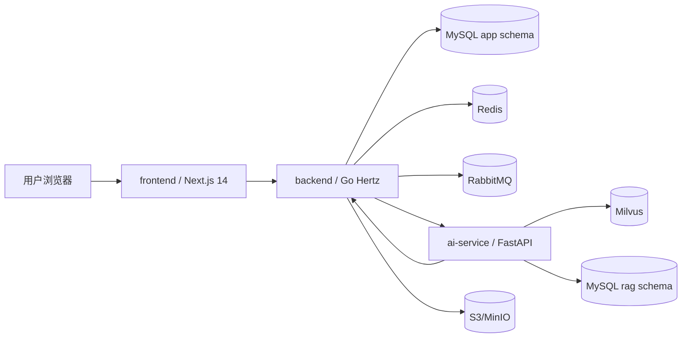

# Interview Coach 技术方案

## Overview
Interview Coach 采用前后端分离的 monorepo 架构：`frontend` 负责候选人交互与页面渲染，`backend` 作为 Go API 网关和业务事实来源，`ai-service` 负责简历解析、RAG 检索和 LLM 编排。系统围绕“上传简历 -> 生成计划 -> 发起面试 -> 异步生成复盘报告 -> 查询历史”这条主链路设计，所有跨服务调用都通过显式 REST 合约或消息队列完成，避免隐式耦合。

## 锁定的 MVP 假设
- 仅支持文本型 PDF，扫描版 OCR 作为后续迭代。
- 登录采用邮箱 + 密码，访问令牌短期有效，刷新令牌轮换。
- 简历解析结果只支持确认，不提供字段级手动编辑。
- 简历解析和复盘报告采用异步任务，面试过程中的追问与检索保持同步。
- 前后端同域部署，生产环境通过 Ingress 将 `/` 路由到前端、`/api/*` 路由到 Go 后端。
- 上传的 PDF 和生成的中间产物使用 S3 兼容对象存储，本地开发用 MinIO。

## 项目目录结构
```text
/
├── frontend/                  # Next.js 14 App Router + TypeScript + Tailwind + shadcn/ui
│   ├── app/                   # 路由、布局、页面
│   ├── components/            # 可复用 UI 与业务组件
│   ├── features/              # 面试、历史、简历、报告等垂直模块
│   ├── lib/                   # API client、auth、utils、schema
│   └── public/
├── backend/                   # Go + Hertz + GORM 的 API 网关与业务层
│   ├── cmd/server/            # 入口
│   ├── internal/
│   │   ├── api/               # HTTP handler / middleware / request-response DTO
│   │   ├── domain/            # 聚合根、实体、领域规则
│   │   ├── service/           # 应用服务、状态机、编排
│   │   ├── repository/        # GORM 数据访问
│   │   ├── job/               # RabbitMQ 生产/消费相关适配
│   │   └── config/
│   └── migrations/
├── ai-service/                # Python FastAPI + RAG + LLM 编排
│   ├── app/
│   │   ├── api/               # 内部 REST 接口
│   │   ├── services/          # 解析、计划、追问、评分
│   │   ├── rag/               # chunk、embedding、retrieve、rerank
│   │   ├── llm/               # provider 抽象、prompt、guardrails
│   │   └── worker/            # 队列消费者
│   └── tests/
├── contracts/                 # OpenAPI / JSON Schema / 事件契约的单一事实源
├── infra/
│   ├── docker-compose.yml      # 本地联调
│   └── k8s/                   # 生产部署 YAML
├── tests/                     # 契约、集成、跨服务测试
├── e2e/                       # 浏览器端到端测试
├── docs/
│   ├── architecture-plan.md
│   └── decisions/
└── scripts/
```

## 服务职责与接口契约概要

### frontend
- 职责：登录、简历上传、JD 输入、面试对话、历史列表、报告详情、错误态和加载态。
- 约束：只消费 `backend` 暴露的公开 REST API，不直接访问 `ai-service`。
- 数据获取：App Router 服务端组件用于首屏读取，客户端组件用于上传、聊天和轮询任务状态。

### backend
- 职责：账号体系、会话管理、历史记录、权限校验、业务状态机、任务编排、审计日志。
- 约束：作为系统事实来源，所有写入都经由它完成；它是 `frontend` 的唯一公开 API。
- 对外协议：`/api/v1/*`，响应统一采用 `{ data, error, traceId }` 包装。

### ai-service
- 职责：简历解析、JD 结构化、RAG 检索、面试追问生成、评分报告生成、知识库向量化。
- 补充：知识库采用离线导入的 curated corpus（面经、八股、项目模板、行为面试素材），不提供在线运营后台。
- 约束：不直接暴露给浏览器；仅接受 `backend` 的内部调用和队列消息。
- 对内协议：`/internal/v1/*`，所有请求都带服务令牌和请求追踪 ID。

### REST API 草图
| 方法 | 路径 | 作用 | 备注 |
|---|---|---|---|
| `POST` | `/api/v1/auth/register` | 注册 | 邮箱 + 密码 |
| `POST` | `/api/v1/auth/login` | 登录 | 返回 access token / 设置 refresh cookie |
| `POST` | `/api/v1/auth/refresh` | 刷新令牌 | 轮换 refresh token |
| `POST` | `/api/v1/auth/logout` | 登出 | 撤销 refresh token |
| `GET` | `/api/v1/me` | 当前用户信息 | 前端初始化 |
| `POST` | `/api/v1/resumes` | 上传简历 | `multipart/form-data` |
| `GET` | `/api/v1/resumes/{resumeId}` | 查看简历解析结果 | 含任务状态 |
| `POST` | `/api/v1/resumes/{resumeId}/confirm` | 确认简历画像 | 进入后续流程 |
| `POST` | `/api/v1/job-descriptions` | 保存 JD | 原文 + 结构化摘要 |
| `POST` | `/api/v1/interview-plans` | 生成面试计划 | 同步调用 AI 服务 |
| `GET` | `/api/v1/interview-plans/{planId}` | 查看面试计划 | 计划版本可追溯 |
| `POST` | `/api/v1/interview-sessions` | 启动面试 | 绑定 planId |
| `GET` | `/api/v1/interview-sessions/{sessionId}` | 会话详情 | 当前轮次、状态、摘要 |
| `POST` | `/api/v1/interview-sessions/{sessionId}/messages` | 发送回答 / 获取追问 | 同步返回 AI 回复 |
| `POST` | `/api/v1/interview-sessions/{sessionId}/finish` | 结束面试 | 触发报告任务 |
| `GET` | `/api/v1/interview-sessions/{sessionId}/report` | 查看复盘报告 | 报告生成后可查 |
| `GET` | `/api/v1/interview-sessions` | 历史列表 | 分页查询 |
| `GET` | `/api/v1/jobs/{jobId}` | 任务状态轮询 | 解析与报告通用 |

### 关键返回体
- `POST /api/v1/resumes` -> `{ resumeId, jobId, status }`
- `POST /api/v1/interview-plans` -> `{ planId, plan, version }`
- `POST /api/v1/interview-sessions/{sessionId}/messages` -> `{ messageId, assistantMessage, citations, latencyMs }`
- `POST /api/v1/interview-sessions/{sessionId}/finish` -> `{ jobId, status }`
- 以上写操作接口统一要求 `Idempotency-Key`，避免重复上传、重复发题和重复触发报告。

### 内部 API 草图
| 方法 | 路径 | 作用 |
|---|---|---|
| `POST` | `/internal/v1/resume-parse` | AI 服务提交简历解析结果 |
| `POST` | `/internal/v1/interview-plan` | 请求面试计划生成 |
| `POST` | `/internal/v1/interview-next-question` | 请求下一轮追问 |
| `POST` | `/internal/v1/report-generate` | 请求复盘报告生成 |
| `POST` | `/internal/v1/rag/search` | 语义检索与引用召回 |
| `POST` | `/internal/v1/jobs/{jobId}/complete` | 回写任务完成结果 |
| `POST` | `/internal/v1/jobs/{jobId}/fail` | 回写任务失败原因 |

## 数据模型概要

### MySQL: `app` schema
- `users`：用户主表，保存邮箱、密码哈希、状态、注册时间。
- `refresh_tokens`：刷新令牌轮换与撤销记录，保存 token hash、设备标识、过期时间。
- `resumes`：上传文件元数据、对象存储地址、解析任务状态。
- `resume_profiles`：简历结构化画像，敏感字段加密存储，非敏感派生字段用于展示和筛选。
- `job_descriptions`：JD 原文、结构化摘要、版本号。
- `interview_plans`：计划 JSON、题目顺序、重点方向、模型版本、prompt 版本。
- `interview_sessions`：面试会话状态、轮次、开始/结束时间、绑定的 plan / resume / jd。
- `interview_messages`：逐轮问答、追问依据、引用 chunk id、token 统计。
- `reports`：评分结果、四维分数、改进建议、报告 JSON、渲染后的 markdown。
- `async_jobs`：通用异步任务表，支持 `resume_parse`、`report_generate` 等类型。
- `audit_logs`：审计日志，记录关键操作和资源访问。

### MySQL: `rag` schema
- `knowledge_documents`：知识来源、标题、来源 URI、状态、版本、embedding 版本。
- `knowledge_chunks`：`id` 主键、分块文本、chunk 序号、hash、token 数、映射到 Milvus 的主键、embedding 版本。

### Milvus collection: `interview_knowledge_chunks`
- `pk`：`Int64` 主键。
- `chunk_id`：`Int64`，对应 `rag.knowledge_chunks.id`。
- `document_id`：`Int64`，对应来源文档。
- `embedding`：`FloatVector`，向量维度在部署时固定，并与选定的 embedding 模型版本绑定。
- `source_type`：`VarChar`，例如 `faq`、`resume`、`system_design`、`behavioral`。
- `topic`：`VarChar`，业务标签。
- `version`：`Int64`，知识版本。
- `embedding_version`：`VarChar`，用于区分不同 embedding 生成批次。
- `created_at`：`Int64`，便于过滤和增量重建索引。
- 索引：`HNSW`，相似度度量使用 `COSINE`。

## ADR 索引
- `docs/decisions/ADR-001-monorepo-and-contract-first.md`
- `docs/decisions/ADR-002-go-hertz-backend.md`
- `docs/decisions/ADR-003-fastapi-ai-service.md`
- `docs/decisions/ADR-004-mysql-system-of-record.md`
- `docs/decisions/ADR-005-milvus-vector-database.md`
- `docs/decisions/ADR-006-redis-rabbitmq-async-jobs.md`
- `docs/decisions/ADR-007-s3-compatible-object-storage.md`
- `docs/decisions/ADR-008-jwt-refresh-auth.md`

## 组件交互图说明


说明：
- 浏览器只访问前端和公开 API。
- 简历上传、计划生成、追问、历史查询都经过 Go 后端。
- AI 服务只通过内部 API 和队列被调用，避免浏览器直接触达模型能力。
- 解析与报告生成走异步队列；面试追问保持同步，以满足首轮响应时延要求。

## 实施顺序
1. 先定 `contracts/` 和 `docs/decisions/`，让接口和边界先冻结。
2. 再搭建 `backend` 的认证、会话、历史、异步任务框架。
3. 然后实现 `ai-service` 的解析、RAG、追问、报告生成。
4. 最后接通 `frontend`、补齐 Docker Compose / Kubernetes YAML，并做端到端验证。

## 风险与缓解
| 风险 | 影响 | 缓解 |
|---|---|---|
| 业务模型和 AI 模型输出漂移 | 高 | 所有模型输出必须过 schema 校验，prompt 和模型版本入库 |
| 异步任务重复执行 | 高 | `async_jobs` 做幂等键、状态机和重试上限 |
| 向量检索与业务数据不一致 | 中 | `chunk_id` 与知识版本入库，重新索引可回放 |
| PII 泄露 | 高 | 敏感字段加密、审计日志、最小权限访问 |

## Open Questions
无。本轮方案已将 PRD 中的产品歧义锁定为 MVP 假设，并在 ADR 中给出依据。
